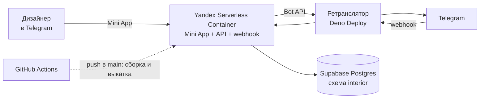

<p align="center">
  
</p>

<h1 align="center">IND Interior Bot</h1>

<p align="center">
  Telegram-бот и Mini App для дизайнеров интерьеров IND.<br>
  Два теста: авторский профиль дизайнера и нарратив конкретного проекта.
</p>

<p align="center">
  <a href="https://t.me/IND_interior_bot"></a>
  
  
  
  
  
</p>

---

## Что это

Внутренний инструмент интерьерного отдела. Вопросы и архетипы выросли из исследования 65 конкурсных офисных интерьеров и 18 премий: из него вышли 11 типов дизайнерского нарратива.

| | Тест | Что даёт |
|---|---|---|
| **01** | **Какой вы тип дизайнера** — 30 вопросов, ~10 минут | Ведущий архетип с разбором, сильные стороны и слепые зоны, колесо профиля по всем 11 архетипам |
| **02** | **Нарратив для проекта** — 35 вопросов, 10–15 минут | Рабочая гипотеза нарратива по брифу, две альтернативы, тезис и аргумент для заказчика, визуальный язык, риски |

Формулировки второго теста подстраиваются под типологию проекта: офис, ресторан, отель, МОП жилого комплекса, аэропорт, музей, спортивный комплекс. Незаконченный тест продолжается с того же вопроса, все результаты лежат в истории.

<p align="center">
  &nbsp;
  &nbsp;
  &nbsp;
  
</p>

## Архитектура



- **Приложение** — одно FastAPI-приложение в контейнере Yandex Cloud: Mini App с корня, API под `/api/v1`, webhook бота там же. Яндекс из РФ открывается без обходов.
- **Ретранслятор** — `proxy/main.ts` на Deno Deploy. Telegram и российские дата-центры друг до друга не достают, поэтому webhook и вызовы Bot API идут через него. Mini App его не использует.
- **База** — Postgres в Supabase, схема `interior`. Бесплатный проект засыпает после недели без запросов: `/api/v1/health` делает `SELECT 1`, а `keepalive.yml` дёргает его раз в день.
- **Вход** — `initData` проверяется один раз и меняется на сессионный токен; бот подписывает токен и в кнопку входа. Токен ходит в заголовке `X-Session-Token`.

Подробности — [docs/architecture.md](docs/architecture.md).

## Структура

```text
app/
  api/        FastAPI: эндпоинты, проверка initData, сессионные токены, webhook
  bot/        aiogram: /start, /app, /help, /privacy, клавиатуры
  core/       настройки из переменных окружения
  domain/     quiz_engine — подсчёт и сборка результата, без привязки к UI
  storage/    repository на asyncpg
content/      вопросы, архетипы, банк формулировок результата (JSON, версии v1)
migrations/   схема базы
proxy/        ретранслятор Telegram ↔ Yandex для Deno Deploy
scripts/      настройка бота, экспорт PDF презентации
tests/        pytest против настоящего Postgres (схема interior_test)
webapp/       Mini App и презентация для отдела (presentation.html)
Dockerfile    образ для Yandex Serverless Containers
```

## Локальный запуск

```bash
python -m pip install -r requirements-dev.txt
cp .env.example .env          # заполнить TELEGRAM_TOKEN, DATABASE_URL и остальное
uvicorn app.api.main:app --port 8010
```

API отдаёт и Mini App с корня: `http://127.0.0.1:8010/`. Чтобы фронт ходил в локальный API, в `webapp/config.js` поменяйте `API_URL`. Локально бот ходит в Telegram напрямую — `TELEGRAM_API_BASE` оставьте пустым. Вне Telegram нет `initData`, поэтому для ручной проверки нужен сессионный токен в адресе (`?t=...`), его выдаёт бот.

```bash
pytest                        # ~3 минуты: тесты собирают схему interior_test в той же базе
```

### Переменные окружения

| Переменная | Зачем |
|---|---|
| `TELEGRAM_TOKEN` | токен бота; им же подписываются сессионные токены |
| `DATABASE_URL` | Postgres; для Supabase — transaction pooler, порт 6543 |
| `DB_SCHEMA` | схема базы, по умолчанию `interior` |
| `WEBHOOK_SECRET` | секрет в заголовке webhook от Telegram |
| `WEBAPP_URL` | адрес Mini App для кнопки бота (только https) |
| `ALLOWED_ORIGINS` | CORS: откуда фронту можно ходить в API |
| `INIT_DATA_MAX_AGE_SECONDS` | срок годности `initData` |
| `TELEGRAM_API_BASE` | адрес Bot API; в облаке — ретранслятор + `/tg`, локально пусто |

## Деплой

Пуш в `main` с изменениями в `app/`, `content/`, `webapp/`, `Dockerfile` запускает `.github/workflows/deploy.yml`: сборка образа → Yandex Container Registry → новая ревизия Serverless Container → проверка `/api/v1/health`.

| Что | Где |
|---|---|
| Секреты бота | Settings → Secrets: `TELEGRAM_TOKEN`, `WEBHOOK_SECRET`, `DATABASE_URL`, `YC_SA_KEY` (авторизованный ключ сервисного аккаунта Yandex Cloud) |
| Адреса и ID | Settings → Variables: `PUBLIC_URL`, `TELEGRAM_RELAY`, `YC_FOLDER_ID`, `YC_REGISTRY_ID`, `YC_CONTAINER_ID`, `YC_SA_ID` |
| Ретранслятор | код из `proxy/main.ts` вставляется в playground Deno Deploy; переменные `UPSTREAM` (адрес контейнера) и `BOT_ID` |
| Webhook и команды бота | `python scripts/setup_bot.py --webhook <адрес ретранслятора>` (`--show` — текущее состояние) |
| PDF презентации | `python scripts/deck_pdf.py` — текст в PDF редактируется в Acrobat |

## Контент

Вопросы, веса и тексты лежат в `content/*.json` и меняются без правки кода.

- **Новая типология проекта:** `<option>` в `webapp/index.html` + ключ в `variants` у вопросов `content/project-narrative.v1.json` + запись в `TYPOLOGIES` теста.
- **Формулировки результата:** `content/result-phrases.v1.json`. Одно и то же прохождение всегда получает один и тот же текст, разные прохождения — разные формулировки одного вывода.

---

<p align="center">
  Разработан: Полина Ишукова · <a href="https://t.me/ded_indigo">@ded_indigo</a> · IND
</p>
