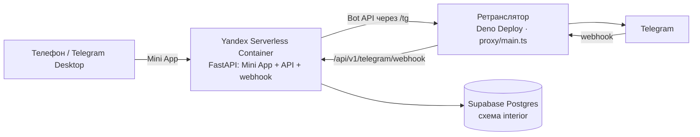

# Архитектура IND Interior Bot

## Схема

Одно FastAPI-приложение (`app/api/main.py`) в одном контейнере:

- `/` — Mini App из `webapp/`;
- `/api/v1/*` — API приложения;
- `/api/v1/telegram/webhook` — webhook бота (aiogram, без отдельного процесса).

**Почему ретранслятор.** Российские дата-центры и Telegram друг до друга не достают: webhook от Telegram в Yandex Cloud не доходит, обратно до `api.telegram.org` из Яндекса тоже. Deno Deploy за рубежом видит обоих и пересылает трафик в обе стороны. Бот ходит в Bot API по адресу из `TELEGRAM_API_BASE`. Mini App через ретранслятор не ходит: Яндекс из РФ открывается напрямую.

**Почему Яндекс.** Mini App открывается на телефонах в РФ: `*.vercel.app`, `supabase.co`, `*.workers.dev`, `*.netlify.app` у части провайдеров недоступны.

**База.** Supabase, transaction pooler (порт 6543), поэтому в asyncpg `statement_cache_size=0` и без `COPY`. Бесплатный проект засыпает после недели без запросов: `/api/v1/health` делает `SELECT 1`, а `.github/workflows/keepalive.yml` дёргает его раз в день.

## Вход

- `initData` проверяется один раз в `POST /api/v1/auth/exchange` и меняется на сессионный токен (HMAC от токена бота, без записи в БД).
- Бот подписывает токен сам и кладёт его в кнопку входа (`?t=`): Telegram-клиенты, особенно Desktop, иногда отдают пустой `initData`.
- Токен с остатком меньше 7 дней API продлевает сам — свежий приходит в заголовке ответа `X-Session-Token`.
- Фронт отправляет токен в заголовке `X-Session-Token`, а не в `Authorization`: этот заголовок Yandex Serverless Containers забирает себе и проверяет как IAM-токен.

## Контент

- Вопросы, веса, нарративы и фразы не зашиваются в код — они версионируются в `content/`.
- Формулировки второго теста подстраиваются под типологию проекта (`object_type`): у вопроса может быть `variants[<typology>]` с подменой текста вопроса и вариантов ответа. Подменяется только текст — id опций и веса общие, поэтому подсчёт одинаков. Сервер применяет подмену в `GET /api/v1/tests/{test_key}?object_type=…`; при возобновлении фронт берёт `object_type` из сессии.
- Результат хранит scoring trace и id текстовых фрагментов для воспроизводимости.

## Модель данных

| Таблица | Назначение |
|---|---|
| `users` | Telegram ID и обновляемый снимок username/имени |
| `projects` | Условный код проекта, типология, площадь и даты |
| `test_sessions` | Каждое прохождение и его версии контента/scoring |
| `session_answers` | Ответы по question ID; поддерживает паузу и продолжение |
| `test_results` | Итог, проценты, confidence, текст и trace |
| `analytics_events` | старт, завершение, отказ и другие продуктовые события |

Первый тест не требует `project_id`. Второй тест связывается с проектом; повторное прохождение создаёт новую сессию. Схема — `migrations/001_interior_schema.sql`.

## Вариативный фидбек второго теста

Результат собирается из смысловых слотов: вводная, почему стратегия подходит брифу, как аргументировать заказчику, визуальный язык, риск, следующий шаг. У каждого фрагмента есть id, теги и версия. Формулировка выбирается детерминированно от id сессии: одно прохождение всегда получает тот же текст, разные — разные формулировки одного вывода.

## Проценты

Процент — нормализованная степень соответствия, а не вероятность успеха. Отдельный `confidence` отражает полноту ответов: 82% совпадения при 48% confidence — сильный кандидат, но данных мало.

## Доступ к данным

- Сотрудник видит только собственную историю.
- Реальные названия заказчиков не хранятся — только код или условное имя проекта.

## Открытые вопросы

- Нет rate-limit на API.
- Сессионный токен нельзя отозвать — только сменой токена бота.
- Нет администраторского экспорта результатов (`ADMIN_TELEGRAM_IDS` пока не используется).
